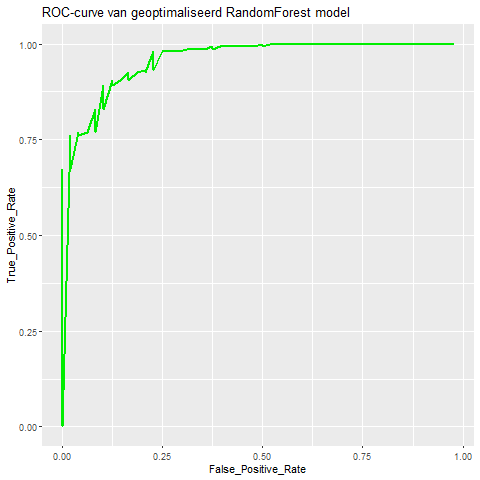
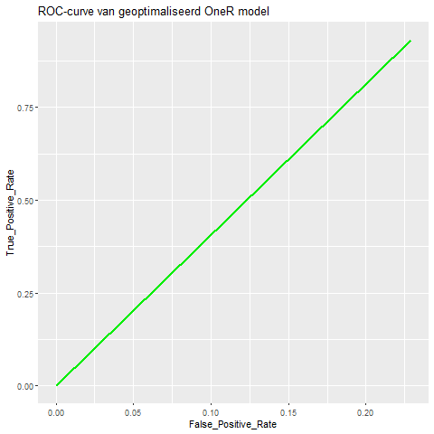
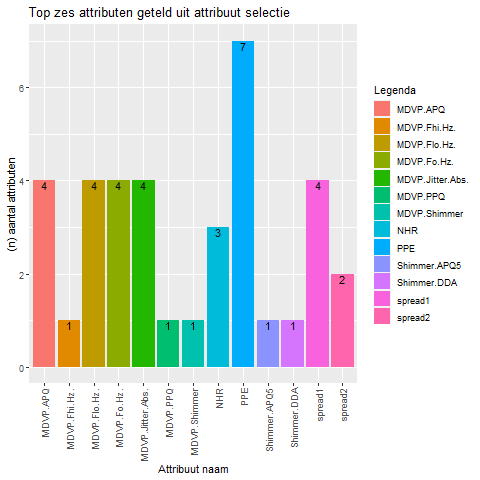

```{r setup, include=FALSE}
knitr::opts_chunk$set(echo = TRUE)
```


\tableofcontents

\pagebreak


# Afkortingen
Parkinson Dysfonie (PD)

# Introductie

Welke type stemopnames kunnen gebruikt worden om een Parkinson patiënt te onderscheiden van een gezond persoon?
In dit onderzoek zullen de Parkinson Dysphonia (PD) geluidsopnames van 195 individuen onderzocht worden via exploratieve data analyse (EDA) en zal er bepaald worden welke metingen het beste zijn om een PD-patiënt te onderscheiden met een gezond mens. De geleverde dataset is supervised, dit betekent dat het al bekend is wie gezond is en wie PD heeft (*Yunfeng, W. et al (03-05-2017)*).

Het onvrijwillig samentrekken van stembanden of strottenhoofd is Spasmodische dysfonie (Engels: Dysphonia). (*LUMC*). Dit zorgt voor vernauwde spraak en breken van stemgeluid. (*Hillel, Dr. A.*). Omdat dysfonie een symptoom kan zijn van Parkinson (*Dystonie vereniging*) zijn er 22 kenmerken in stemgeluid opgenomen via verschillende methoden, met als voorbeeld lage stem frequenties. Deze worden nader uitgelegd in Materiaal & methoden. 

In de EDA wordt met het programma Weka via select features en baselearning bepaald wat de beste attributen zijn en welk model het beste op deze data kan trainen.
Hieruit wordt het duidelijk dat er zes attributen (kenmerkende geluidsopnamen): MDVP.Fo.Hz., MDVP.Flo.Hz.,  MDVP.Jitter.Abs., Shimmer.DDA, NHR en PPE de beste combinatie vormen om mensen met PD te vinden. Deze groep worden gegeven aan een geoptimaliseerde RandomForest model die op de supervised data voor 93.3333 procent goed voorspeld. 

Op basis van deze bevindingen is er een Java (jar) programma gemaakt die kan Voorspellen op zowel een supervised als unsupervised bestand of enkele regel (patiënt) met de zes eerder genoemde attributen.
Om dit programma te testen is daarom de data opgesplitst in supervised data waarop het model is getraind en unsupervised data waarop het model niet op is getraind. Het programma doet het beter op de getrainde supervised data voor 98,46 procent goed en op de test data voor 96,15 procent goed. 


\pagebreak

# Materiaal & Methode

In dit hoofdstuk wordt behandeld waar het gebruikte materiaal vandaan komt en welke methoden hierop zijn toegepast.
Zie log.Rmd in https://github.com/Coldbirdie/Datamining_09 voor volledige uitwerking van het interpreteren en onderzoeken.

&nbsp;

**Dataset**
Via Kaggle is er een csv bestand opgehaald met 24 kolommen (*Kaggle - Yunfeng, W. et al (03-05-2017)*). Twee hiervan zijn nominaal. Dit betekent dat één kolom patiënten ids heeft en één kolom heeft de statussen; nul en een, deze zijn respectievelijk veranderd naar "gezond" en "ziek" voor leesbaarheid. Verder bevat het bestand 195 instanties (patiënten), waarvan 147 ziek zijn (PD) en 48 zijn gezond. De 22 numerieke kolommen zijn geluidsopnames bepaald via verschillende methoden, die verderop worden toegelicht.

Hieronder is een vertaald tabel dat ieder attribuut beschrijft, deze is overgenomen uit het artikel die bij de dataset hoort (*Yunfeng, W. et al (03-05-2017)*) (tabel 2). 

**Tabel 1** Beknopt overzicht van attributen namen, de eenheden ervan, de data typen en beschrijvingen.


De attributen kunnen worden verdeeld in groepen meetmethoden, op basis van de linker delen van iedere naam: MDVP, Shimmer, harmonics, spread en losse methoden.
De eerste groep genaamd MDVP is een programma en staat voor "Multi-Dimensional Voice Program". Hiermee kunnen 33 stem parameters geanalyseerd worden, waarmee metingen in de stem zoals frequenties of de amplitude van trillingen worden geschat (*Nicastri, M. et al*). 

&nbsp;

De tweede groep genaamd Shimmer bestaat uit sequentiële metingen van het maximale bereik van de amplitude in de trillingen dat een stem iedere keer maakt.
Verder beschrijft harmonics de verhouding tussen geluid in de spraak met een bepaalde tijdsduur en geluid juist zonder een bepaalde tijdsduur (*Fernandes, J. et al*). De attributen HNR en NHR die hierbij horen hierbij. Groep spread met attributen spread1 en spread2 en PPE zijn attributen met metingen van variaties in frequenties. Op PPE ofwel Pitch Period Entropy gaat het artikel zelf meer op in. Het is namelijk een techniek om dysfonie te meten. Het kan preciezer veranderingen in stemgeluid meten, wanneer er ruis bij betrokken is. Dit is voordelig bij stemgeluid, zoals kenmerkend bij mensen met dysfonie.

De overige attributen Jitter:DDP, RPDE, DFA en D2 worden ieder anders bepaald. Ten eerste kijkt Jitter:DDP naar het gemiddelde volledige verschil tussen de verschillen tussen ieder keer dat een stem wordt opgenomen gedeeld door de gemiddelde tijdsduur. Attributen DFA (detrended fluctuation analysis) en RPDE (recurrence period density entropy) worden gebruikt voor het detecteren van algemene stemstoornissen, door te kijken naar ruis of willekeurigheid in stemgeluid. Het laatste attribuut D2 is een correlatiedimensie dat ingewikkelde dynamiek schetst behorend bij dysfonie (*Yunfeng, W. et al (03-05-2017)*). 

&nbsp;
\pagebreak

**Pakketten en functies**
De volgende pakketten zijn ingeladen om figuren te maken en om deze netjes te maken.

```{}
# Pakket om tabellen mooier te maken
library("pander")
panderOptions("table.continues", "")
# Pakket voor maken van mooiere figuren dan de standaard figuren
library("ggplot2")
# Pakket om correlatie matricen te maken
library("ggcorrplot")
# Pakket om figuren in een raster te verdelen
library("gridExtra")
# Pakket om een paar plot
library("GGally")
```

&nbsp;

Met ggpairs uit het "GGally" pakket zijn correlatie figuren gemaakt om verbanden in gedrag te vinden tussen attributen. Plot methode 'ggpairs' maakt een matrix van de ontvangen attributen en kijkt naar hoe de waarden zijn opgebouwd en vergelijkt deze met elkaar. Dit kan ook wel het gedrag van de gemeten data worden genoemd en de vergelijking wordt uitgedrukt in een correlatie coëfficiënt. Deze ligt tussen één (positieve feedback (terugkoppeling) in gedrag), naar nul (weinig tot geen feedback in gedrag) tot min één (negatieve feedback in gedrag). Met gedrag wordt er bijvoorbeeld bedoeld dat de ene meetwaarden omhoog of omlaag gaan vergeleken met andere meetwaarden. Hieronder is voorbeeld code om een pairs plot te maken. Hierbij zitten er vijf MDVP-attributen in MDVP.small.

```{}
ggpairs(data.numeric[MDVP.small-2], ggplot2:: aes(color=levels.of.status, alpha = 0.5), progress = FALSE, upper = list(continuous = wrap(ggally_cor, size = 3.5))) + labs(caption = "Pair plot showing correlations between six MDVP attributes\n and showing how similar the status data is between them") + theme(axis.text.x = element_text(angle=90, hjust = 1),
        axis.text.y = element_blank())                                                                                                                                                                
```


Tevens zijn er correlatie matrices gemaakt via ggcorrplot van pakket "ggcorrplot" die met kleuren en waarden tussen min één en één (negatieve tot positieve correlatie) attributen vergelijken. Middels het observeren van hele positieve of negatieve waarden zijn er attributen genoteerd met als hypothese dat de attributen met sterke correlaties samen, goed gezond kunnen onderscheiden van ziek. Hieronder is voorbeeld code om een correlatie matrix te maken. De matrix die eerst wordt aangemaakt bedraagt de eerste zes en de laatste zes numerieke attributen.

```{}
corr.matrix3 <- cor(data.numeric[1:6], data.numeric[16:22])
ggcorrplot(corr.matrix3, lab = T, lab_size = 2, lab_col = "black") + labs(caption = "Correlation heatmap of first and last attributes")
```


Door te kijken naar de normaal verdelingen van alle attributen is er bepaald dat veel data uitschieters heeft en dus niet normaal verdeeld is. De verdelingen zijn gevisualiseerd via ggplot uit het pakket "ggplot2". Hieronder is de code om dat te doen voor attribuut PPE.

```{}
F.22.log <- ggplot(patient.data, aes(x=log(PPE), fill = status)) + geom_histogram(color = "black", bins = 39)
grid.arrange(F.22.log, ncol = 1, nrow = 2)
```

Na een 10log-transformatie van veertien attributen, vertoonde ze een betere normaal verdeling. Deze stap motiveerde om alle numerieke attributen te log-transformeren, zodat de waarden niet te veel afwijken in grootte. Omdat spread1 negatieve meetwaarden bevat, is deze niet log-getransformeerd. Tevens zijn de log-getransformeerde meetwaarden en de meetwaarden van spread1 gelijk in groottes, dus wijkt spread1 niet af.

Deze stap is op de volgende manier gedaan
```{}
data.for.scaling <- subset(patient.data, select = c(-name, -status, -spread1))
data.for.scaling
logTransformed.patient.data.left <- data.frame(log(data.for.scaling[1:18]), spread1 = patient.data$spread1)
logTransformed.patient.data.right <- data.frame(log(data.for.scaling[19:21]))
combined.log.data <- data.frame(logTransformed.patient.data.left, logTransformed.patient.data.right, status = patient.data$status)
write.csv(combined.log.data, file = "log_patient_data.csv", row.names = FALSE)
```

&nbsp;

\pagebreak

**Weka analyse**
Om te zien hoe deze stappen in Weka zijn uitgevoerd, zie "Select features in explorer" in log.Rmd voor instructies.

Ten eerste zijn er modellen (bekend als classifiers) getest op de normale data in de Explorer. Vervolgens wordt tussen de modellen uit de Explorer stap gekeken via de experimenter naar welk model het beste traint op de data. Tevens wordt er in de experimenter vergeleken tussen de originele dataset en de log-getransformeerde dataset. Aan de experimenter worden alle modellen toegevoegd met standaard instellingen en met aangepaste instellingen. Ook wordt er in de experimenter onderscheidt gemaakt in vergelijkings-velden (comparison fields).

Er wordt gekeken welk model het meest accuraat voorspeld in procent of de precisie (precision) wordt vergeleken. Verder laat de vals negatief percentage (false negative rate) zien welk model de meeste- of minste zieke mensen foutief gezond voorspeld. DE AUC (Area under the Curve) curve bepaalt de kwaliteit van ieder model en runtime bepaalt de uitvoertijd per model. Als laatste geeft de F-maat (F_measure) een vergelijking naar hoe relevant de verkregen informatie is per model (relevance of information gain).

&nbsp;

Op basis van deze resultaten is er bepaald welke modellen het beste zijn. De volgende stap "select features" ofwel kies attributen, kijkt welke attributen het meest optimaal zijn voor ieder model om goed te voorspellen. Er is tussen verschillende attribuut evaluatoren (attribute evaluators) gekozen in combinatie met een zoekmethode. De volgende evaluatie methoden zijn gebruikt: WrapperSubsetEval, CorrelationAttributeeval, GainRatioAttributeEval, InfoGainAttributeEval, OneRAttributeEval en Attribute-subset evaluation. Hoe deze zijn toegepast is ook te vinden in de bijlage.

Door te kijken of er attributen overlappen in de resultaten van alle evaluatoren samen die zijn uitgevoerd, is er bepaald welke attributen het beste lijken in het algemeen en welke het meest compatibel zijn voor de eerder gevonden beste modellen. Er wordt steeds gekeken naar de top zes en hiervan wordt een histogram gemaakt met alle attributen en hoe vaak op de y-as deze als beste voorkomen. Hieronder is de code te zien:

&nbsp;

Verder zijn de beste modellen geoptimaliseerd in Classify via Baselearners. Deze staan onder de meta folder bij het classificeer menu. Op One-R en RandomForest is Vote (stemmen), Bagging (in zakjes verdelen) en Stacking (opstapelen) toegepast. De instellingen van deze modellen zijn hetzelfde als de beste die gevonden zijn in de Experimenter stap. 

Naast het optimaliseren wordt nog de kwaliteit van ieder model gevisualiseerd in een AUC grafiek. Dit kan in Weka door rechte muisknop te klikken op de resulterende modellen, te drukken op "Visualize threshold curve" en vervolgens "sick" of "healhty" te kiezen. De kwaliteit van het model wordt bepaald door te kijken hoe ver de curve in de linker boven hoek ligt. Vervolgens kan het beste model gekozen worden door de kwaliteit en accuraatheid van de modellen in overweging te nemen.

&nbsp;

Het beste model is "RandomForest" en deze is verbeterd met Bagging. Als laatste stap is er geprobeerd om de parameters van RandomForest verder in te lezen en aan te passen, om het model nog accurater te maken. Tevens is uit de select features gevonden dat zes attributen het beste scoren op RandomForest via de WrapperSubsetEval attribuut evaluator. Hiervan is een nieuw arff bestand van opgeslagen inclusief de status kolom. Met dit bestand is er getest om verschillende parameters en het veranderen van numFeatures in RandomForest leverde een toename op in accuraatheid.

Uit de Weka test fase zijn een beste model en de beste attributen gevonden. Het model is opgeslagen via rechter muisklik op het resultaat model en te drukken op "Save model".


&nbsp;

\pagebreak

**Javawrapper**
De gevonden attributen en het model zijn tevens in een een javawrapper verwerkt.
Om een Java programma te maken dat om kan gaan met arff data en een model zijn er verschillende pakketten gebruikt en documentatie. De pakketten en code uitwerkingen daarbij en andere benodigdheden staan in de Javawrapper folder (https://github.com/Coldbirdie/Datamining_09/tree/main/JavaWrapper). 

In het "README" bestand staan alle pakketten onder elkaar en is een gedetailleerde uitleg. Echter, is hieronder een beknopt stappenplan in hoe het Java programma is opgebouwd.

&nbsp;

Ten eerste om argumenten te ontvangen van de CLI (Command line interface) is het pakket org.apache.commons.cli.* gebruikt. Vervolgens om het model en een arff bestand in te kunnen lezen en om hiermee op de data te gaan voorspellen zijn er verschillende klassen gebruikt uit twee pakketten, namelijk weka en java. Omdat apache en weka niet in Java zitten, moesten deze worden geïmplementeerd via build.gradle onder "dependencies".

In het programma zijn vier vormen van voorspellen toegevoegd op twee verschillende typen data. Het programma kan voorspellen op een arff bestand met de eerder zes genoemde attributen. De eerste twee vormen van voorspellen kan op data waar al bekend is wie ziek is of niet, of er mag data gegeven worden waarin dit niet bekend is. De andere twee
vormen van voorspellen zijn hetzelfde, maar een gebruiker hoeft maar één regel op te geven met de zes attributen in dezelfde volgorde als in een arff bestand.


\pagebreak


# Resultaten

In dit hoofdstuk worden de resultaten van de EDA en van Machine learning gevisualiseerd en geobserveerd.

## EDA

De dataset omvatte 24 kenmerken die gemeten waren voor 195 individuen, hiervan 147 patienten en 48 gezonde personen, en bevatte geen ontbrekende waarden

&nbsp;

De rijen zijn verdeeld in 48 gezonden instanties en 147 PD-patiënten instanties. Deze zijn in een bar plot hieronder te zien.


**Figuur 1** bar plot dat de aantallen per groep laat zien. Op de x-as zijn de statussen healthy (gezond) en sick (PD-patiënt) en op de y-as is de hoeveelheid uitgedrukt in mensen.

Zoals te zien in figuur 1 zijn er drie keer zo veel zieke dan gezonde mensen in de dataset.

\pagebreak


**Tabel 2** Samenvattting (summary) van meetwaarden in NHR en HNR.

|       NHR       |      HNR       |
|:---------------:|:--------------:|
| Min.   :0.00570 | Min.   : 8.441 |
| 1st Qu.:0.00958 | 1st Qu.:19.198 |
| Median :0.01347 | Median :22.085 |
| Mean   :0.01788 | Mean   :21.886 |
| 3rd Qu.:0.02238 | 3rd Qu.:25.076 |
| Max.   :0.07940 | Max.   :33.047 |

 

In tabel 2 vielen attributen NHR (noise-to-harmonics ratio) en HNR (harmonics-to-noise ratio) op. Deze hebben namelijk waardes die bijna tegenover elkaar lijken te staan. Om na te gaan of er inderdaad een verband is tussen de twee wordt er een 'ggpairs' plot gemaakt. Hierin zijn distributies te zien, een paarsgewijs scatterplot en een correlatiecoëfficiënt.


**Figuur 2** GGpairs plot van attributen NHR en HNR. Over de x en- y-as wordt HNR als functie van NHR uitgezet. Op de diagonaal zijn distributies geplot. Linksonder is de scatterplot. Rechtsboven staat het correlatie coëfficiënt. 

In figuur 2 is te zien dat de scatterplot als een niet vloeiende boog afloopt, dit geeft aan dat er een negatieve correlatie is. Het feit dat deze niet vloeiend loopt, is terug te zien in het correlatie coëfficiënt van -0.714. Dus zijn de gemeten waarden niet exact omgekeerd van elkaar. Verder heeft HNR redelijk normaal verdeelde data, maar NHR helemaal niet.

Verder zijn er boxplots gemaakt per level van de attributen MDVP.Fo.Hz., MDVP.Fhi.Hz. en MDVP.Flo.Hz. in eenheid Hertz (Hz).


**Figuur 3** Metingen van drie MDVP-attributen in Hertz per status. Op de x-as staan de attributen en op de y-as de frequenties (Hz).

In figuur 3 hebben gezonde mensen hogere frequenties (tussen 100 en 200 tot boven 200 Hz) dan mensen met PD (vrijwel alles onder 200 Hz). Uit de EDA werd dit nog sterker bevestigd met ANOVA toetsen die de volgende p-waarden gaven:

**** Verschillen tussen klasse labels van drie attributen getoetst op alpha = 0.05.

| Attributen | P-waarden |
|------------|----------|
| Fo.Hz      | 3e-08    |
| Fhi.Hz     | 2e-02    |
| Flo.Hz     | 4e-08    |


In de bovenstaande tabel is te zien dat alle p-waarden kleiner zijn dan alpha, dit betekent een significant verschil.

&nbsp;

\pagebreak

Nadat de data werd log-getransformeerd is er een welch t-toets gedaan op elke attribuut op basis van de klasse labels, om te zien hoe erg de label data van elkaar verschilt. 
In tabel 4 is te zien hoe erg de meetwaarden uit de "gezonde" groep verschillen van de "zieke" groep voor ieder attribuut. 

**Tabel 4** Welch t-toetsing van de klasse labels van alle attributen

----------------------------
    Attribute       p.value 
------------------ ---------
   MDVP.Fo.Hz.      8.1e-05 

   MDVP.Fhi.Hz.      0.007  

   MDVP.Flo.Hz.     5.7e-05 

  MDVP.Jitter...    1.5e-09 

 MDVP.Jitter.Abs.   2.7e-10 

     MDVP.RAP       6.6e-10 

     MDVP.PPQ       3.9e-11 

    Jitter.DDP      6.6e-10 

   MDVP.Shimmer     1.4e-14 

 MDVP.Shimmer.dB.   5.6e-14 

   Shimmer.APQ3      2e-11  

   Shimmer.APQ5     3.3e-14 

     MDVP.APQ       3.1e-18 

   Shimmer.DDA      2.1e-11 

       NHR          1.7e-07 

       HNR          2.7e-09 

       RPDE         2.9e-05 

       DFA          0.0011  

     spread1        1.8e-21 

     spread2        3.3e-06 

        D2          1.2e-06 

       PPE          6.1e-17 
----------------------------

Uit tabel 4 wordt het duidelijk dat voor alle attributen een significant verschil is, omdat alle p-waarden kleiner zijn dan alpha = 0.05.
Er is te zien dat attribuut MDVP.APQ de laagste p-waarde heeft van 3.1e-18 en vervolgens PPE met een p-waarde van 6.1e-17.

&nbsp;


Uit het observeren van alle attributen als histogrammen werd het duidelijk dat vijftien attributen niet normaal verdeeld waren. Daarom zijn deze met log10 getransformeerd en met succes vertoonden ze daarna wel normaal verdelingen. Als voorbeeld worden de histogrammen van zeven MDVP attributen getoond, omdat deze veel data naar links verdeeld hadden.

 

**Figuur 4** Stapel histogrammen van MDVP-attributen voor en na log-transformatie. Op de x-as staat de verdeling per attribuut en op de y-as de grootte van de gemeten waarden. Rood is gezond en blauw is ziek.

In figuur 4 is te zien dat na log-transformatie de data symmetrischer verdeeld is en beter een normaalverdeling volgt.

&nbsp;

Vervolgens zijn er drie correlatie matrices gemaakt om de data op te delen en te vergelijken. In de onderstaande plot staat een selectie van attributen waar een correlatiematrix de correlatiecoëfficiënten tussen paren attributen toont.


**Figuur 5** Correlatie heatmap van een selectie aan attributen. Op zowel de x-as als y-as staan attributen die hun eigen data representeren. De coëfficiënten worden verdeeld van paars (negatief één) naar wit (neutraal nul) tot rood (positief één).

In de heatmap is te zien hoe erg de attributen waarden correleren. Links onder in zijn de Shimmer attributen met correlaties van bijna één, dus meetwaarden met erg vergelijkbare oploop. Attributen HNR en NHR hebben een correlatiecoëfficiënt van -0.71, dit bevestigt hun negatieve correlatie. Verder zijn er waarden rond nul te zien en heel veel tussen nul en één in.

Om meer beeld te krijgen van hoe sterk attributen paarsgewijs samenhangen, kan er een groot ggpairs figuur gemaakt worden waar de groepen zichtbaar zijn. In de volgende figuur zijn attributen gekozen die of negatieve correlaties vertoonden of juist erg positief.

 

**Figuur 6** Correlatie paar plot tussen verschillende attributen en de twee groepen Op de x-as de grootte van hun waarden en op de y-as verschillende weergaven om verschillen of correlaties aan te tonen. Er zijn drie weergaven in de figuur waar linksonder van rechtsboven wordt gescheiden door een diagonaal van berg grafieken die de overlapping tussen statussen per attribuut weergeeft. In andere woorden hoe erg de waarden op elkaar lijken die gemeten zijn. Linksonder zijn spreidingsdiagrammen. Hieruit is de paarsgewijze samenhang van attributen af te lezen. Rechtsboven de diagonaal staan alle correlatiecoëfficiënt waarden tussen paren van attributen en hun statussen. 

In de derde spreidingsdiagram van de eerste kolom PPE gaan de punten van links onder naar rechts boven. Dit vertoond een positieve correlatie, hierin is ook een zeker onderscheidt tussen het merendeel van de statussen. Daar rechts naast is een grafiek met meer een wolk spreiding van links boven naar rechts onder. Deze vertoond negatieve correlatie.

In de berg grafiek van D2 van zit er weinig verschil tussen de meetwaarden van de groepen, dit is te zien aan het grote overlap tussen de bergen. Daartegenover lijkt bij PPE  juist een veel groter verschil, door er maar een klein overlap is.

Uit het raster met correlatiecoëfficiënten is te zien dat spread1 en PPE een erg positieve correlatie hebben van 0.963 en de groepen verschillen maar met acht. Deze attributen reageren dus erg positief op elkaar. Daartegenover staan Shimmer.APQ3 en DFA met een correlatie vlakbij nul. Er is weinig reactie op elkaar en ook amper verschil tussen de groepen. Tevens hebben D2 en HNR juist een negatieve correlatie, ze reageren juist van elkaar weg.

&nbsp;

\pagebreak

## Supervised Machine Learning

Via de experimenter in Weka zijn er tabellen gegenereerd waarin te zien is hoe alle modellen presteren bij verschillende vergelijking velden.
Hieronder zijn drie tabellen die wat zeggen over hoe relevant of accuraat de voorspellingen zijn. In de eerste twee tabellen zijn alleen de beste modellen te zien, die niet overfit zijn.

Verder geeft een v'tje een significant verschil aan tussen log-getransformeerde data en normale data, een sterretje geeft een iets minder significant verschil aan.

&nbsp;

Het vergelijkings-veld "percent_correct" (procent goed) gaf het volgende tabel en toont aan hoeveel procent ieder model goed voorspeld van nul (incorrect) tot honderd procent (correct). 

**Tabel 5** Overzicht van de top drie modellen die hebben voorspeld, deze zijn getoetst in percentages.

| Dataset                   | (1) log_patient_data  | (2) patient_data_ |
|---------------------------|-----------------------|--------------------|
| trees.J48 '-U -M 3' -2177|    84.9342104200      |   84.8315788500   |
| rules.OneR '-B 20 -batch-|    85.0026314700      |   85.1026314700   |
| trees.RandomForest '-P 10|    91.7026315000      |   91.4052630800   |
|                           |         (v/ /*)       |      (1/10/0)     |

Uit de bovenstaande tabel is te zien dat RandomForest met normale instellingen het meest accuraat is op ongeveer 91.5 procent. Daarna voor bijna zes procent minder is OneR met een bucket size van twintig en J48 met unpruning, confidenceFactor op 0.20 en minNumObj op drie, doet het bijna even goed als OneR.

&nbsp;

Het vergelijkings-veld "F_measure" gaf het volgende tabel en toont aan hoeveel informatie dat is verkregen daadwerkelijk relevant is, met nul (niet relevant) tot één (wel relevant).

**Tabel 6** Overzicht van de top drie modellen die hebben voorspeld, deze zijn getoetst op hoe relevant de verkregen informatie is en staat bekend als de F-maat.

| Dataset                   | (1) log_patient  | (2) patient_data_ |
|---------------------------|-----------------|--------------------|
| lazy.IBk '-K 20 -W 0 -A  |    0.907115     |     0.896487       |
| rules.OneR '-B 20 -batch-|    0.907970     |     0.908560       |
| trees.RandomForest '-P 10|    0.946769     |     0.945139       |
|                           |      (v/ /*)    |      (0/8/3)       |

RandomForest doet het beste met ongeveer 0.94, wat dus betekent dat er veel informatie relevant is. OneR en Ibk met twintig buren doen het vrijwel even goed op ongeveer 0.90.


&nbsp;

Het vergelijkings-veld "False_negative_Rate" gaf het volgende tabel en toont de foutenmarge aan waarin zieke mensen zijn voorspeld als gezond, met nul is geen fouten tot één waar alle zieke mensen als gezond zijn voorspeld.

**Tabel 7** Overzicht van alle niet overfitte modellen, deze zijn getoetst op hoeveel zieke mensen als gezond worden gemarkeerd in een marge tussen nul en één.

| Dataset                   | (1) log_patient  | (2) patient_data_ |
|---------------------------|-----------------|--------------------|
| rules.ZeroR '' 4805554146 |      0.000000   |      0.000000      |
| lazy.IBk '-K 20 -W 0 -A  |      0.020333   |      0.003381      |
| rules.OneR '-B 20 -batch-|      0.025191   |      0.025238      |
| trees.RandomForest '-P 10|      0.028476   |      0.027714      |
| trees.J48 '-U -M 3' -2177|      0.099286   |      0.104048      |
| trees.J48 '-C 0.25 -M 2' |      0.104619   |      0.105952      |
| bayes.NaiveBayes '-batch-|      0.299667   |      0.369524 v    |
| bayes.NaiveBayes '' 59952|      0.299667   |      0.369524 v    |
| bayes.NaiveBayes '-batch-|      0.299667   |      0.369524 v    |
|                           |      (v/ /*)    |      (3/8/0)       |
                                  
De standaard NaiveBayes en de andere NaiveBayes modellen met een batchsize ingesteld op honderdtwintig en tachtig maken de meesten fouten in voorspellen van zieke mensen.
Het v'tje toont aan dat op de originele data significant meer fouten worden gemaakt dan op de log data. J48 modellen doen het op het oog veel minder slecht dan NaiveBayes. Verder maken IBk, OneR en RandomForest de minste fouten. Omdat er meer zieke patiënten zijn heeft ZeroR alle instanties als ziek voorspeld en zijn er dus geen zieke mensen als gezond voorspeld. 

Via bagging is RandomForest verbeterd en OneR met bucketsize twintig en een batchsize van hondertwintig is verbeterd via Stacking door te leren van RandomForest en J48 met unpruning op True, confidenceFactor op 0.20 en minNumObj op drie. 

**Tabel 8** Verbeterde RandomForest en OneR met voorspellingen in procent goed

| RandomForest | OneR     |
|--------------|----------|
| 92.3077 %    | 89.2308 %|


Uit het optimaliseren is het duidelijk geworden dat RandomForest het beste voorspeld. Om de kwaliteit vast te stellen zijn er ook ROC-curven gemaakt van de modellen.

  

**Figuur 7** ROC-curves van geoptimaliseerde RandomForest en OneR. Op de x-as staat de "false positive rate" en op de y-as de "true positive rate". Hoe meer de curve naar links boven buigt hoe meer er "true positives" en hoe minder "false positives" er zijn. In andere worden hoe meer zieke mensen goed worden geraden en hoe minder zieke mensen als gezond worden geraden.

In de figuur is te zien dat OneR een diagonale lijn heeft van links onder naar rechts boven, dus de goed geraden zieke mensen neemt toe tegen toename van fout geraden gezonde mensen. Verder heeft RandomForest een curve dat stijl stijgt op de y-as en daarna bijna niet meer stijgt over de toename van de x-as.

\pagebreak

**Attribuut evaluatie en eind model optimaliseren in de Explorer**

Via de WrapperSubsetEval attribuut selectie methode is onderzocht welke attributen het beste waren om op te voorspellen door RandomForest.

**Tabel 9** Attributen waar RandomForest het best op voorspeld.

Attributen  | 
----------- |
MDVP.Fo.Hz. |
MDVP.Flo.Hz. |
MDVP.Jitter.Abs. |
Shimmer.DDA |
NHR |
PPE |


Via zeven evalueer methoden e.g. WrapperSubsetEval zijn er tijdens attributen selectie verschillende rangschikkingen gevormd van alle attributen. Hiervan zijn steeds de top zes attributen geteld en van die tellingen is een bar plot gemaakt. 

 
**Figuur 8** Tellingen van de top zes attributen uit alle evaluatie methodes. Op de x-as staan de attributen, op de y-as de tellingen en de kleuren van de staven zijn arbitrair. In de legenda is een overzichtje van de attributen en de bijbehorende kleuren.

In de bovenstaande figuur is te zien dat attribuut PPE het vaakst (zeven keer) in de top zes was en attributen: MDVP.APQ, MDVP.Flo.Hz, MDVP.Fo.Hz, MDVP.Jitter.Abs en spread1 kwamen er vier keer in voor.

Nu de beste attributen en het beste model zijn gevonden is er een poging gedaan om RandomForest te verbeteren door het willekeurig aantal gekozen attributen te zetten op zeven en vervolgens het model te laten trainen alleen op die attributen. Hierop volgde dat de verbeterde RandomForest plus de zes attributen: MDVP.Fo.Hz., MDVP.Flo.Hz.,  MDVP.Jitter.Abs., Shimmer.DDA, NHR, PPE zorgde voor de volgende resultaten.

&nbsp;

**Tabel 10** Voorspellingen van zieke en gezonde mensen op basis van zes attributen.

| Voorspellingen             | Waarden    |
|----------------------------|------------|
| Ziek als gezond voorspeld  | 5          |
| Gezond als ziek voorspeld  | 8          |
| Ziek goed voorspeld        | 142        |
| Gezond goed voorspeld      | 40         |
| Totaal goed voorspeld (%)  | 93.3333 %  |
| Totaal fout voorspeld (%)  | 6.6667 %   |


Uit de bovenstaande model en matrix is af te lezen dat voor ~ 93.3 procent goed wordt voorspeld wie gezond en ziek is. En in totaal worden er dertien fouten voorspellingen gemaakt van de 195.

\pagebreak

# Discussie

## Figuren & tabellen

Vanwege het feit dat de hoeveelheid zieke mensen in figuur 1 drie keer zo veel is als gezonde mensen, moet er rekening gehouden worden dat statistisch gezien meer toevallige data punten voorkomen en de observaties zullen daarom minder als hard bewijs gezien worden. Tevens is er de kans dat machine learning modellen meer trainen op de ene groep dan de andere, waardoor het model minder accuraat zal voorspellen. Al hoewel het voor onderzoeken en model training nu genoeg data is, zou als vervolg onderzoek een grotere dataset gebruikt kunnen worden om zekerder te zijn van alle observaties.

In figuur 2 is er sprake van geen volledige negatieve correlatie; een verklaring kan zijn dat de formules gebruikt voor het meten van HNR en NHR niet evenredig omgekeerd zijn. 

&nbsp;

In figuur 3 werd het duidelijk dat de eerste MDVP-attributen met status "Gezond" significant hogere frequenties vertoonden dan die met status "PD-patiënt". Dit werd bevestigd door tabel 3. Het feit dat deze opnames op zichzelf al zo een groot onderscheidt maken tussen de statussen, geeft de gedachte dat ze gebruikt kunnen worden als knopen in een model training om de data op te splitsen. OneR zou in dat geval interessant zijn om deze te testen, aangezien het algoritme het attribuut uitkiest die de data het beste splitst vergeleken met de andere attributen. 

Figuur 4 laat zien dat log10 transformeren effectief de data normaliseert. Het is interessant om deze getransformeerde data in een apart bestand te zetten, om te zien of de attributen met uitschieters (Engels: outliers) van voor het log-transformeren anders worden beoordeeld door het model dan een dataset met wel getransformeerde data. Een argument hiervoor is dat uitschieters meer verspreid zijn en daarom zal de splits waarde tussen de statussen anders zijn, dan wanneer de data dichter bij elkaar is gebracht.

&nbsp;

Verder gaf de heatmap in figuur 5 overzichtelijk weer hoe attributen op elkaar reageren. Deze correlaties kunnen positief, neutraal of negatief op elkaar reageren. Dit beeld werd het meest duidelijk met HNR en NHR, zodra de instantie van HNR toenemen worden de waarden van NHR lager. Dit beschrijft de negatieve correlatie die de attributen vertonen in een kruis patroon op de heatmap met elkaar, maar ook met andere attributen. 

Alhoewel de heatmap naar verbanden kijkt in attributen, kan er niet uit worden gehaald of de attributen samen daadwerkelijk een onderscheidt kunnen maken tussen de statussen. Er kan alleen worden gespeculeerd dat bij een positieve correlatie en negatieve correlatie de waarden van de statussen zullen verschillen door positieve of negatieve feedback van waarden.

&nbsp;

Aansluitend bij figuur 5 geeft figuur 6 extra informatie over het gedrag van data i.v.m. de correlatie coëfficiënten. Het werd duidelijk dat er patronen zijn die correlaties representeren, dus links onder naar rechts boven is positieve correlatie, links boven naar rechts onder is negatieve correlatie en een verspreide wolk geeft zwakkere correlatie aan. Attributen PPE en spread1 vertonen een mooie scheiding tussen de statussen, tegelijkertijd met een hoge correlatie waarde. De vraag is of deze vorm van scheiding een betere grens is tussen de statussen, dan een negatieve correlatie zoals HNR en PPE met een grotere punten wolk en dus zwakkere correlatie.

Omdat er meer zieke instanties zijn is er een manier om tijdens model training meer onderscheidt te maken tussen de klasse label. Namelijk door fouten zwaarder mee te tellen voor groep gezond, zal het model voorzichtiger te werk gaan tussen de klasse label. Het model probeert daardoor minder fouten te maken bij gezond. 

&nbsp;

In tabel 4 hebben attributen MDVP.APQ en PPE de kleinste p-waarden. Dit kan betekenen dat hierin het beste onderscheidt is tussen groep gezond en ziek. Tevens zouden deze attributen mogelijk goed zijn voor modellen om op te trainen.

&nbsp;

In tabel 5 deed RandomForest het beste op goed voorspellen. Dit was al verwacht aangezien RandomForest meerdere bomen maakt waaruit een betere uitkomst bepaald wordt. Van J48 werd verwacht dat het relatief goed zou doen. Het kort knippen van takken in J48 (pruning) is uitgezet, met als motivatie zo goede voorspellingen te behouden die anders weg geknipt zouden worden. OneR heeft een bucket size van twintig, dit betekent dat de dataset van circa 200 instanties in tien emmertjes is verdeeld waarop wordt voorspeld. Door de data op te delen in een niet overdreven aantal stukjes, kunnen er minder fouten gemaakt worden bij splitsen op attributen. Met deze gedachte gang wordt verwacht dat er relatief veel goed zal worden voorspeld.

&nbsp;

In tabel 6 staan RandomForest en OneR wederom in de top 2. De F-maat kijkt naar hoeveel mensen ziek zijn voorspeld, maar ook naar hoeveel mensen die ziek zijn voorspeld ook daadwerkelijk ziek zijn. OneR en RandomForest delen data op of herhalen training, wat leidt tot mindere fouten dus een hogere F-maat. Echter, waarom is lazy.Ibk met twintig buren dan in de top drie? Er zijn twintig buren die steeds stemmen voor een label van een instantie en dankzij die hoeveelheid neemt de foutenmarge af. Ook al doet lazy.Ibk het niet beter dan J48 uit tabel 4 voor alle voorspellingen, is de foutenmarge voor het voorspellen van zieke mensen lager.

&nbsp;

Uit tabel 7 wordt het duidelijk dat NaiveBayes de meeste vals negatieven voorspeld, oftewel zieke mensen als gezond gemarkeerd. NaiveBayes berekend de kans op ieder klasse label gegeven de attributen. Waarschijnlijk worden er meer foute voorspellingen gemaakt, doordat de kansen niet goed berekend kunnen worden op de data van de attributen. NaiveBayes berekend kansen bij numerieke data via een normaal verdeling formule op steeds een enkele instantie en het gemiddelde, de standaard deviatie van alle data met dezelfde klasse label worden hierin meegenomen. Er is een kans berekening voor de data van alle zieke mensen en een kans berekening voor de gezonden mensen in een kolom. De hogere kans is de voorspelde label. Omdat er veel meer zieke instanties zijn, is er de aanname dat het onbalans van instanties die in de twee kans berekeningen worden verwerkt, zorgt voor meer incorrecte voorspellingen. Daarom schiet NaiveBayes bovenaan in het verkeerd voorspellen van zieke mensen.

&nbsp;

Uit tabel 8 en figuur 7 wordt het duidelijk dat RandomForest het 'betere' model is voor deze data na optimalisatie vergeleken met OneR. Dit werd al verwacht, aangezien RandomForest op zichzelf al erg al erg accuraat is, bagging varieert de trainingsdata steeds en alle getrainde RandomForests bepalen samen weer een beste uitkomst. Alhoewel OneR erg verbeterd is door te leren van J48 en RandomForest, blijft het minder accuraat dan RandomForest. Tevens wordt in figuur 7 duidelijk dat RandomForest kwalitatief beter is dan OneR. Dit was te observeren uit het feit hoe de curve van RandomForest erg naar links boven neigt in het begin en daarna over de x-as sterk afneemt met dalen. De curve toont aan dat er veel zieke instanties goed worden voorspeld (True positive rate op de y-as) en weinig gezonde instanties verkeerd worden voorspeld (False positive rate op de x-as).
Daartegenover vertoont de diagonale lijn bij OneR dat hoe meer gezonde mensen als ziek voorspeld worden hoe meer zieke mensen goed worden voorspeld. Het voorspellen gaat wel dus goed voor zieke mensen, maar de logica wijkt af van gewoon direct instanties goed voorspellen die ziek zijn en zo min mogelijk fouten maken bij gezonde mensen. Want de bedoeling is dat een model voor beide klassen zo veel mogelijk fouten voorkomt.

&nbsp;

Uit tabel 9 en figuur 8 werd duidelijk welke attributen het beste zijn om op te voorspellen. Uit de EDA vielen attributen NHR, MDVP.Flo.Hz/ MDVP.Fo.Hz / MDVP.Jitter.Abs.
en PPE op. Na het selecteren van attributen en trainen van modellen werd het duidelijk dat deze inderdaad ook bij de beste attributen hoorden. Echter, viel attribuut Shimmer.DDA niet op. Tevens komt het alleen voor in de top zes van RandomForest tijdens attribuut selectie. Shimmer.DDA kijkt naar de gemiddelde verschillen tussen amplituden van trillingen van opeenvolgende tijdsduren. De waarden hiervan moeten voor RandomForest genoeg onderscheid hebben om samen met de andere vijf attributen betere voorspellingen te kunnen maken.

&nbsp;

De laatste tabel 10 toont eind voorspellingen van het geoptimaliseerde RandomForest met de meest compatibele attributen. Het model is best accuraat en maakt weinig fouten. Echter, worden er wel vijf mensen die ziek zijn als gezond voorspeld. In de praktijk is dit niet gewild, omdat deze mensen nu niet door verwezen worden voor medische hulp.
Daartegenover staan acht mensen die gezond zijn en als ziek zijn voorspeld, Alhoewel dit niet levend bedreigend is voor de patiënt, kost dit wel onnodig tijd en geld voor controles.

## Werkwijze
In dit project is er niet consequent genoeg gewerkt. Voor alle stappen had meer tijd moeten worden genomen voor efficiëntie in werk en voor meer accurate observatie van de data en resultaten. Tevens is het modeltraining gedaan op de hele dataset, zonder in het achterhoofd te houden dat er ook test data moet worden gebruikt. Bij het testen van de Javawrapper is daarom het RandomForest model opnieuw getraind op zestig procent van de instanties en veertig procent wordt gebruikt als test data. In toekomstig (machine learning) onderzoeken is het belangrijk om dit te beseffen, omdat het belangrijk is om een zuivere controle groep te hebben.

Om dit onderzoek voort te zetten zou er meer data gemeten moeten worden van mensen met Parkinson en gezonde mensen voor de gevonden attributen. Bovendien zou deze dataset ongeveer evenveel instanties per groep moeten hebben en moet er een duidelijke trainingsgroep en testgroep zijn. Op basis van deze nieuwe data kan er worden bevestigd dat RandomForest met een vergelijkbare accuraatheid blijft voorspellen.

&nbsp;

# Conclusie

Welke type stemopnames kunnen gebruikt worden om een Parkinson patiënt te onderscheiden van een gezond persoon? Deze vraag is beantwoord door een geoptimaliseerde RandomForest te laten trainen op de volgende zes supervised attributen: MDVP.Fo.Hz., MDVP.Flo.Hz.,  MDVP.Jitter.Abs., Shimmer.DDA, NHR en PPE. Het merendeel van deze attributen viel al op bij het observeren van hun data in grafieken en toesting. 

In Weka voorspeld het model voor 93 en 1/3 procent goed voor wie wel PD heeft en wie niet op alle instanties in de dataset. Zoals in de introductie is verteld is RandomForest opnieuw getraind op 60 procent van de instanties, zodat er wel een test (controle) groep is dat 40 procent van de instanties bedraagt. De test data werd voor 96,15 procent goed voorspeld in de Javawrapper. Al met al is het gelukt om een groot deel van de data goed te voorspellen, maar zijn er nog wel punten om te verbeteren.


&nbsp;


\pagebreak

# Literatuurlijst

- Chatterjee, S. (24-11-2019). *Use Naive Bayes Algorithm for Categorical and Numerical data classification*

Link : 
https://rb.gy/d570rg

- Dystonie vereniging. *Wat is de relatie tussen Parkinson en dystonie? (B)* 

Link :
https://dystonievereniging.nl/magazine/wat-is-de-relatie-tussen-parkinson-en-dystonie-b/#:~:text=Dystonie%20is%20een%20onwillekeurige%20spiercontractie,ziekte%20zelf%2C%20zonder%20andere%20symptomen

- Fernandes, J., Teixeira, F., Guedes, V., Junior, A. en Teixeira, J. P. *Harmonic to Noise Ratio Measurement - Selection of Window and Length* 

Link :
https://www.sciencedirect.com/science/article/pii/S1877050918316739#:~:text=Harmonic%20to%20Noise%20Ratio%20(HNR,analysis%20to%20diagnose%20pathologic%20voices

- Hillel, Dr. A. *Spasmodic Dysphonia*

Link :
https://www.hopkinsmedicine.org/health/conditions-and-diseases/spasmodic-dysphonia

- Indeed editorial team (04-02-2023). *Negative Correlation: Definition and Examples (With Types)*

Link : https://www.indeed.com/career-advice/career-development/negative-correlation-definition-and-examples 

- LUMC. *Spasmodische dysfonie* 

Link : 
https://rb.gy/m4rawe

- Nicastri, M., Chiarella, G., Gallo, L., Cassandro, E. en Catalano, M. *Multidimensional Voice Program (MDVP) and amplitude variation parameters in euphonic adult subjects. Normative study*

Link :
https://rb.gy/724wgm

- Yunfeng, W. et al (03-05-2017). *Research from diagnosing people with PD using vocal recordings*

Link : https://www.ncbi.nlm.nih.gov/pmc/articles/PMC5434464/

- Kaggle - Yunfeng, W. et al (03-05-2017). *Parkinson’s Disease Data Set*

Link : 
https://www.kaggle.com/datasets/vikasukani/parkinsons-disease-data-set?resource=download

- Zhang, E., Zhang, Y. (2009). *F-Measure*

Link : 
https://link.springer.com/referenceworkentry/10.1007/978-0-387-39940-9_483 

