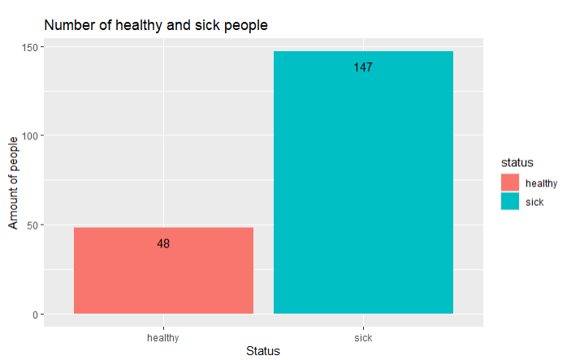
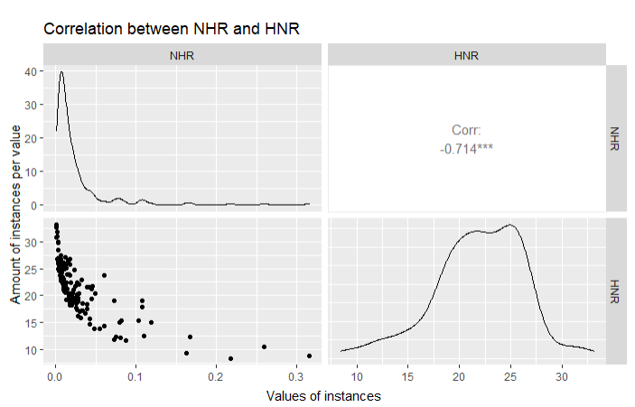
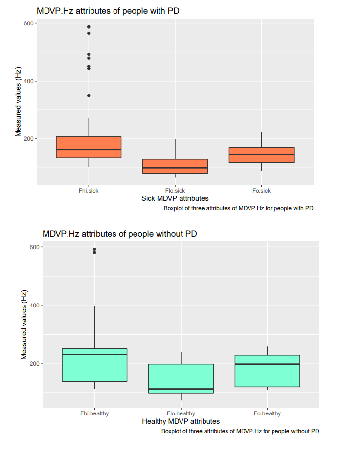
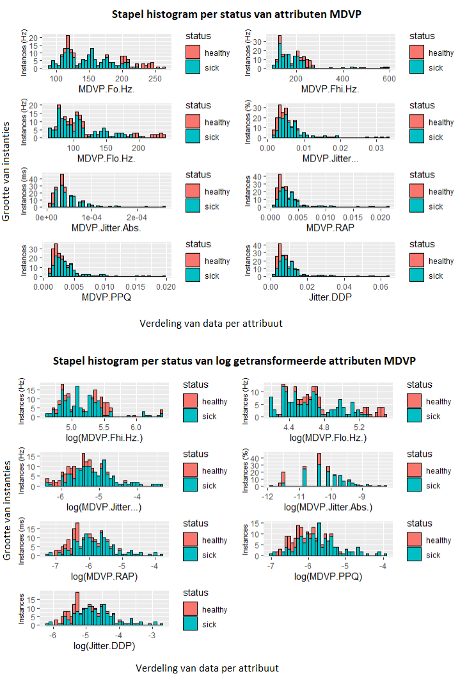
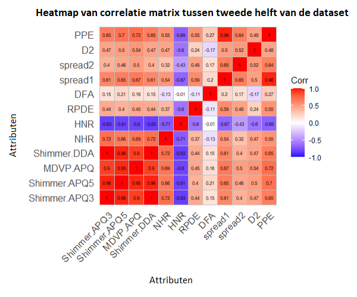
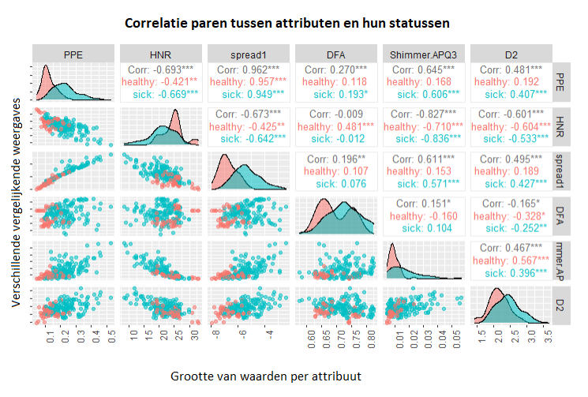

```{r setup, include=FALSE}
knitr::opts_chunk$set(echo = TRUE)
```

# Afkortingen
Parkinson Dysphonia (PD)

# Introductie

Welke type stemopnames kunnen gebruikt worden om een Parkinson patiënt te onderscheiden van een gezond persoon?
In dit onderzoek zullen de Parkinson Dysphonia (PD) geluidsopnames van 195 individuen onderzocht worden via exploratieve data analyse (EDA) en zal er bepaald worden welke metingen het beste zijn om een PD patiënt te onderscheiden met een gezond mens. \bibitem{Kaggle dataset}. De geleverde dataset is supervised, dit betekent dat het al bekend is wie gezond is en wie PD heeft.

Het onvrijwillig samentrekken van stembanden of strottenhoofd is Spasmodische dysfonie (Engels: Dysphonia). \bibitem{Dysphonia betekenis}. Dit zorgt voor vernauwde spraak en breken van stemgeluid. \bibitem{Dysphonia symptomen}. Omdat dysfonie een symptoom kan zijn van Parkison \bibitem{Parkinson en dystonie} zijn er 22 kenmerken in stemgeluid opgenomen via verschillende methoden, met als voorbeeld lage stem frequenties. Deze worden nader uitgelegd in Materiaal & methoden. 

In de EDA wordt met het programma Weka via select features en baselearning bepaald wat de beste attributen zijn en welk model het beste op deze data kan trainen.
Hieruit wordt het duidelijk dat er zes attributen (kenmerkende geluidsopnamen): MDVP.Fo.Hz., MDVP.Flo.Hz.,  MDVP.Jitter.Abs., Shimmer.DDA, NHR en PPE de beste combinatie vormen om mensen met PD te vinden. Deze groep worden gegeven aan een geoptimaliseerde Random Forest model die op de supervised data voor 93.3333 procent goed voorspeld. 

Op basis van deze bevindingen is er een Java (jar) programma gemaakt die kan Voorspellen op zowel een supervised als unsupervised bestand of enkele regel (patiënt) met de zes eerder genoemde attributen.
Om dit programma te testen is daarom de data opgesplitst in supervised data waarop het model is getrained en unsupervised data waarop het model niet op is getrained. Het programma doet het beter op de getrainde supervised data voor 98,46 procent goed en op de test data voor 96,15 procent goed. 


\pagebreak

# Materiaal & Methode

In dit hoofdstuk wordt behandeld waar het gebruikte materiaal vandaan komt en welke methoden hierop zijn toegepast.

## Dataset
Via Kaggle is er een csv bestand opgehaald met 24 kolommen \bibitem{Kaggle dataset}. Twee hiervan zijn nominaal, dat betekent dat één kolom patiënten id's heeft en één kolom heeft de statussen nul en een, deze zijn respectievelijk veranderd naar "gezond" en "ziek" voor leesbaarheid. Verder bevat het bestand 195 instanties (patiënten), waarvan 147 ziek zijn (PD) en 48 zijn gezond. De 22 numerieke kolommen zijn geluidsopnames bepaald via verschillende methoden.

Hieronder is een vertaald tabel dat ieder attribuut beschrijft, deze is overgenomen uit het artikel die bij de dataset hoort \bibitem{Dysphonic voice analysis} (tabel 2). 


De attributen kunnen worden verdeeld in groepen meetmethoden, op basis van de linker delen van iedere naam: MDVP, Shimmer, harmonics, spread en losse methoden.
De eerste groep genaamd MDVP is een programma en staat voor "Multi-Dimensional Voice Program". Hiermee kunnen 33 stem parameters geanalyseerd worden, waarmee metingen in de stem zoals frequenties of de amplitude van trillingen worden geschat \bibitem{MDVP definitie}. 

De tweede groep genaamd Shimmer bestaat uit sequentiële metingen van het maximale bereik van de amplitude in de trillingen dat een stem iedere keer maakt.
Verder beschrijft harmonics de verhouding tussen geluid in de spraak met een bepaalde tijdsduur en geluid juist zonder een bepaalde tijdsduur \bibitem{Harmonics definitie}. De attributen HNR en NHR die hierbij horen hierbij. Groep spread met attributen spread1 en spread2 en PPE zijn attributen met metingen van variaties in frequenties. Op PPE ofwel Pitch Period Entropy gaat het artikel zelf meer op in. Het is namelijk een techniek om dysfonie te meten. Het kan preciezer veranderingen in stemgeluid meten, wanneer er ruis bij betrokken is. Dit is voordelig bij stemgeluid, zoals kenmerkend bij mensen met dysfonie.

De overige attributen Jitter:DDP, RPDE, DFA en D2 worden ieder anders bepaald. Ten eerste kijkt Jitter:DDP naar het gemiddelde volledige verschil tussen de verschillen tussen ieder keer dat een stem wordt opgenomen gedeeld door de gemiddelde tijdsduur. Attributen DFA (detrended fluctuation analysis) en RPDE (recurrence period density entropy) worden gebruikt voor het detecteren van algemene stemstoornissen, door te kijken naar ruis of willekeurigheid in stemgeluid. Het laatste attribuut D2 is een correlatiedimensie dat ingewikkelde dynamiek schetst behorend bij dysfonia \bibitem{Dysphonic voice analysis}. 

## Data interpreteren en opschonen

Zie log.Rmd in https://github.com/Coldbirdie/Datamining_09 voor volledige uitwerking van het interpreteren en onderzoeken.

Met ggpairs uit het "GGally" pakket zijn correlatie figuren gemaakt om verbanden in gedrag te vinden tussen attributen. Met gedrag wordt er bijvoorbeeld bedoeld dat de ene meetwaarden omhoog of omlaag gaan vergeleken met andere meetwaarden. Hieronder is voorbeeld code om een pairs plot te maken. Hierbij zijn de data MDVP.small vijf attributen betrokken bij MDVP.

```{}
ggpairs(data.numeric[MDVP.small-2], ggplot2:: aes(color=levels.of.status, alpha = 0.5), progress = FALSE, upper = list(continuous = wrap(ggally_cor, size = 3.5))) + labs(caption = "Pair plot showing correlations between six MDVP attributes\n and showing how similar the status data is between them") + theme(axis.text.x = element_text(angle=90, hjust = 1),
        axis.text.y = element_blank())                                                                                                                                                                
```


Tevens zijn er correlatie matrices gemaakt via ggcorrplot van pakket "ggcorrplot" die met kleuren en waarden tussen min één en één (negatieve tot positieve correlatie) attributen vergelijken. Middels het observeren van hele positieve of negatieve waarden zijn er attributen genoteerd met als hypothese dat de attributen met sterke correlaties samen, goed gezond kunnen onderscheiden van ziek. Hieronder is voorbeeld code om een correlatie matrix te maken. De matrix die eerst wordt aangemaakt bedraagt de eerste zes en de laatste zes numerieke attributen.

```{}
corr.matrix3 <- cor(data.numeric[1:6], data.numeric[16:22])
ggcorrplot(corr.matrix3, lab = T, lab_size = 2, lab_col = "black") + labs(caption = "Correlation heatmap of first and last attributes")
```


Door te kijken naar de normaal verdelingen van alle attributen is er bepaald dat veel data uitschieters heeft en dus niet normaal verdeeld is. De verdelingen zijn gevisualiseerd via ggplot uit het pakket "ggplot2". Hieronder is de code om dat te doen voor attribuut PPE.

```{}
F.22.log <- ggplot(patient.data, aes(x=log(PPE), fill = status)) + geom_histogram(color = "black", bins = 39)
grid.arrange(F.22.log, ncol = 1, nrow = 2)
```

Na een 10log-transformatie van veertien attributen, vertoonde ze een betere normaal verdeling. Deze stap motiveerde om alle numerieke attributen te log-transformeren, zodat de waarden niet te veel afwijken in grootte. Omdat spread1 negatieve meetwaarden bevat, is deze niet log-getransformeerd. Tevens zijn de log-getransformeerde meetwaarden en de meetwaarden van spread1 gelijk in groottes, dus wijkt spread1 niet af.

Deze stap is op de volgende manier gedaan
```{}
data.for.scaling <- subset(patient.data, select = c(-name, -status, -spread1))
data.for.scaling
logTransformed.patient.data.left <- data.frame(log(data.for.scaling[1:18]), spread1 = patient.data$spread1)
logTransformed.patient.data.right <- data.frame(log(data.for.scaling[19:21]))
combined.log.data <- data.frame(logTransformed.patient.data.left, logTransformed.patient.data.right, status = patient.data$status)
write.csv(combined.log.data, file = "log_patient_data.csv", row.names = FALSE)
```

## Weka attribuut en model onderzoek

Om te zien hoe deze stappen in Weka zijn uitgevoerd, zie log.Rmd voor instructies.

Ten eerste zijn er modellen (bekend als classifiers) getest op de normale data in de Explorer. Vervolgens wordt tussen de modellen uit de Explorer stap gekeken via de Experimenter naar welk model het beste traint op de data. Tevens wordt vergeleken tussen de originele dataset en de log-getransformeerde dataset. Hierbij wordt de experimenter meerdere malen uitgevoerd, met verschillende parameter instellingen per model. Ook wordt er in de experimenter onderscheidt gemaakt in vergelijkings velden (comparison fields).

Er wordt gekeken welk model het meest accuraat voorspeld in procent of de precisie (precision) wordt vergeleken. Verder laat de vals negatief percentage (false negative rate) zien welk model de meeste/minste zieke mensen foutief gezond voorspeld. DE AUC (Area under the Curve) curve bepaalt de kwaliteit van ieder model en runtime bepaalt de uitvoertijd per model. Als laatste geeft de F-maat (F_measure) een vergelijking naar hoe relevant de verkregen informatie is per model (relevance of information gain).

Op basis van deze resultaten is er bepaald welke modellen het beste zijn. De volgende stap "select features" ofwel kies attributen, kijkt welke attributen het meest optimaal zijn voor ieder model om goed te voorspellen. Er is tussen verschillende attribuut evaluatoren gekozen in combinatie met een zoekmethode. Door te kijken of er attributen voorkomen in de resultaten van alle evaluatoren samen die zijn uitgevoerd, is er bepaald welke attributen het beste lijken in het algemeen en welke het meest compatibel zijn voor de eerder gevonden beste modellen.

Verder zijn de beste modellen geoptimaliseerd in Classify via Baselearners. Deze staan onder de meta folder bij het classificeer menu. Op One-R en Random Forest is Vote (stemmen), Bagging (in zakjes verdelen) en Stacking (opstapelen) toegepast. De instellingen van deze modellen zijn hetzelfde als de beste die gevonden zijn in de Experimenter stap. 

Naast het optimaliseren wordt nog de kwaliteit van ieder model gevisualiseeerd in een AUC grafiek. Dit kan in Weka door rechte muis te klikken op de resulterende modellen, te drukken op "Visualize threshold curve" en vervolgens "sick" of "healhty" te kiezen. Na het vaststellen welke model beter is door te zien hoe ver naar links boven de curve staat kan het beste model gekozen worden door de kwaliteit en accuraatheid van de modellen in overweging te nemen.

Het beste model is "Random Forest" en deze is verbeterd met Bagging. Als laatste stap is er geprobeerd om de parameters van Random Forest verder in te lezen en aan te passen, om het model nog accurater te maken. Tevens is uit de select features gevonden dat zes attributen het beste scoren op Random Forest via de WrapperSubsetEval attribuut evaluator. Hiervan is een nieuw arff bestand van opgeslagen inclusief de status kolom. Met dit bestand is er getest om verschillende parameters en het veranderen van numFeatures in Random Forest leverde een toename op in accuraatheid.

Uit de Weka test fase zijn een beste model en de beste attributen gevonden. Het model is opgeslagen via rechter muisklik op het resultaat model en te drukken op "Save model".

## Javawrapper programma en omgaan met data

Om een Java programma te maken dat om kan gaan met arff data en een model zijn er verschillende pakketen gebruikt en documentatie. De pakketen en code uitwerkingen daarbij en andere benodigheden staan in de Javawrapper folder (https://github.com/Coldbirdie/Datamining_09/tree/main/JavaWrapper). In de README staan alle pakketten onder elkaar en is een gedetailleerde uitleg. Echter is hieronder een beknopt stappenplan in hoe het Java programma is opgebouwd.

Ten eerste om argumenten te ontvangen van de CLI (Command line interface) is het pakket org.apache.commons.cli.* gebruikt. Vervolgens om het model en een arff bestand in te kunnen lezen en om hiermee op de data te gaan voorspellen zijn er verschillende klasses gebruikt uit twee pakketten, namelijk weka en java. Omdat apache en weka niet in Java zitten, moesten deze worden geïmplementeerd via build.gradle onder "dependencies".

In het programma zijn vier vormen van voorspellen toegevoegd op twee verschillende typen data. Het programma kan voorspellen op een arff bestand met de eerder zes genoemde attributen. De eerste twee vormen van voorspellen kan op data waar al bekend is wie ziek is of niet, of er mag data gegeven worden waarin dit niet bekend is. De andere twee
vormen van voorspellen zijn hetzelfde, maar een gebruiker hoeft maar één regel op te geven met de zes attributen in dezelfde volgorde als in een arff bestand.


\pagebreak


# Resultaten

In dit hoofdstuk worden de resultaten van de EDA en van Machine learning gevisualiseerd en geobserveerd.

## EDA

### Volledigheid

Het csv bestand was volledig en er waren geen NA waarden. Daarom hoefden er geen beslissingen genomen worden om waarden te verwijderen. Het bestand bestaat uit 24 kolommen en 195 rijen. Van deze kolommen zijn er 22 numeriek en twee nominaal, namelijk de namen van de patiënten en interessanter de statussen (levels) gezond (geen Parkinson) en ziek (Parkinson patient). Zes kolommen hebben eenheden, namelijk Hertz, procent, milliseconde en decibel; zoals eerder besproken in de inleiding.

&nbsp;

De rijen zijn verdeeld in 48 gezonden instanties en 147 PD patiënten instanties. Deze zijn in een barplot hieronder te zien.



**Figuur 1** Barplot dat de aantallen per levels laat zien. Op de x-as zijn de statussen gezond (healthy) en sick(PD patiënt) en op de y-as is de hoeveelheid uitgedrukt in mensen.

Zoals te zien in figuur 1 zijn er drie keer zo veel rijen van zieke mensen dan gezonde mensen in de dataset.

\pagebreak

### Attributen observeren

Uit de samenvatting van de data vielen attributen NHR (noise-to-harmonics ratio) en HNR (harmonics-to-noise ratio) op. Deze hebben namelijk waarde die bijna tegenover elkaar lijken te staan, deze zijn te zien in de bijlage bij het samenvattende tabel. Om na te gaan of er inderdaad een verband is tussen de twee wordt er een 'ggpairs' plot gemaakt. Deze plot methode maakt een matrix van de ontvangen attributen en kijkt naar hoe de waarden zijn opgebouwd en vergelijkt deze met elkaar. Dit kan ook wel het gedrag van de gemeten data worden genoemd en de vergelijking wordt uitgedrukt in een correlatie coëfficiënt. Deze ligt tussen 1 (positieve feedback in gedrag), naar nul (weinig tot geen feedback in gedrag) tot -1 (negatieve feedback in gedrag).



**Figuur 2** GGpairs plot van attributen NHR en HNR. Op de x-as zijn de groottes van de gemeten waarden en op de y-as de hoeveelheid waarden per grootte. Links boven en rechts onder zijn deze hoeveelheden geplot. Links onder is de correlatie dat in een niet vloeiende boog van links boven naar rechts onder loopt. Rechts boven staat het correlatie coëfficient.

In figuur 2 is te zien dat de boog afloopt, dit geeft aan dat er een negatieve correlatie is. Het feit dat deze niet vloeiend loopt is terug te zien in het correlatie coëfficiënt van -0.714. Dus zijn de gemeten waarden niet exact omgekeerd van elkaar.

Verder zijn er boxplots gemaakt per level van de attributen MDVP.Fo.Hz., MDVP.Fhi.Hz. en MDVP.Flo.Hz. in eenheid Hertz (Hz).



**Figuur 3** Metingen van drie MDVP attributen in Hertz per status. Op de x-as staan de attributen en op de y-as de frequenties (Hz).

In figuur 3 hebben gezonde mensen hogere frequenties (F = 150\>200) dan mensen met PD (F= 150\<200). Uit de EDA werd dit nog sterker bevestigd met ANOVA toetsen die de volgende p-waarden gaven:

Fo.Hz = 3.121919e-08 Fhi.Hz = 0.02027567 Flo.Hz = 4.197004e-08

| Attributes | P-values     |
|------------|--------------|
| Fo.Hz      | 3.121919e-08 |
| Fhi.Hz     | 0.02027567   |
| Flo.Hz     | 4.197004e    |

Uit het observeren van alle attributen als histogrammen werd het duidelijk dat veertien attributen niet normaal verdeeld waren. Daarom zijn deze met log10 getransformeerd en met succes vertoonden ze daarna wel normaal verdelingen. Als voorbeeld zijn worden de histogrammen van attributen MDVP getoond, omdat deze veel data naar links verdeeld hadden.

 

**Figuur 4** Stapel histogrammen van MDVP attributen voor en na log-transformatie. Op de x-as staat de verdeling per attribuut en op de y-as de grootte van de gemeten waarden. Rood is gezond en blauw is ziek.

In figuur 4 is te zien dat na log-tranformatie de data naar het midden verschuift.

&nbsp;

Vervolgens zijn er drie correlatie matrices gemaakt om de data op te delen en te vergelijken. In de onderstaande plot staat de tweede helft van alle numerieke attributen.



**Figuur 5** Correlatie heatmap van tweede helft van de dataset. Op zowel de x-as als y-as staan attributen die hun eigen data representeren. De coëfficiënten worden verdeeld van paars (negatief één) naar wit (neutraal nul) tot rood (positief één).

In de heatmap is te zien hoe erg de attributen waarden op elkaar reageren qua gedrag. Links onder in zijn de Shimmer attributen met correlaties van bijna één, dus meetwaarden met erg vergelijkbare oploop. Attributen HNR en NHR zijn paars, deze bevestigen hun negatieve correlatie. Verder zijn er waarden rond nul te zien en heel veel tussen nul en één in.

Om meer beeld te krijgen van het gedrag tussen data dat correlatie aantoont kunnen er grotere GGpairs grafieken gemaakt worden waar de statussen zichtbaar zijn. In de volgende grafiek zijn attributen gekozen die of negatieve correlaties vertoonden of juist erg positief.

 

**Figuur 6** Correlatie paar plot tussen verschillende attributen en de twee statussen. Op de x-as de grootte van hun waarden en op de y-as verschillende weergaves om verschillen of correlaties aan te tonen.

In figuur 6 zijn drie typen weergaven te zien. Links onder in een driehoek met puntgrafieken. Het gedrag van de correlaties is hieruit af te lezen. Bijvoorbeeld de vierde van de eerste kolom PPE gaat van links onder naar rechts boven. Die vertoond een positieve correlatie, hierin is ook een zeker onderscheidt tussen het merendeel van de statussen. Daar rechts naast is een grafiek met meer een wolk spreiding van links boven naar rechts onder. Deze vertoond negatieve correlatie.

Verder wordt links onder van rechts onder gescheiden door berg grafieken die de overlapping tussen statussen per attribuut weergeeft. In andere woorden hoe erg de waarden op elkaar lijken die gemeten zijn. In D2 zit er weinig verschil tussen de meetwaarden van de groepen, maar bij PPE lijkt juist een veel groter verschil.

Overigens maar zeker belangrijk bevat de driehoek van rechts boven in alle correlatie coëfficiënt waarden tussen paren van attributen en hun statussen. Spread1 en PPE heeft een erg positieve correlatie van 0.963 en de groepen verschillen maar met acht. Deze attributen reageren dus erg positief op elkaar. Daartegenover staan Shimmer.APQ3 en DFA met een correlatie vlakbij nul. Er is weinig reactie op elkaar en ook amper verschil tussen de groepen. Tevens hebben D2 en HNR juist een negatieve correlatie, ze reageren juist van elkaar weg.

&nbsp;

\pagebreak

### Supervised Machine Learning

\pagebreak

## Discussie

Vanwege het feit dat de hoeveelheid zieke mensen in figuur 1 drie keer zo veel is als gezonde mensen, moet er rekening gehouden worden dat statistisch gezien meer toevallige data punten voorkomen en de observaties zullen daarom minder als hard bewijs gezien worden. Uit berekening uit de EDA komen er ongeveer tien vals positieven voor, door alpha 0.05 te vermenigvuldigen met het aantal rijen. Al hoewel het voor onderzoek en model training genoeg data is zou als vervolg onderzoek een grotere dataset gebruikt kunnen worden om zekerder te zijn van alle observaties.

In figuur 2 is er sprake van geen volledige negatieve correlatie; een verklaring kan zijn dat de formules gebruikt voor het meten van HNR en NHR niet evenredig omgekeerd zijn. Als voorbeeld 2log(8) = 3 en 2^3 = 8, de formules zijn evenredig omgekeerd verbonden aan elkaar.

&nbsp;

In figuur 3 werd het duidelijk dat de eerste MDVP attributen met status "Gezond" significant hogere frequenties vertoonden dan die met status "PD patiënt". Het feit dat deze opnames op zichzelf al zo een groot onderscheidt maken tussen de statussen, geeft de gedachte dat ze gebruikt kunnen worden als knopen in een model training om de data op te splitsen. OneR zou in dat geval interessant zijn om deze te testen, aangezien het algoritme de attribuut uitkiest die de data het beste splitst vergeleken met de andere attributen.

Figuur 4 laat zien dat log10 transformeren effectief de data normaliseerd. Het is interessant om deze getransformeerde data in een apart bestand te zetten, om te zien of de attributen met outliers (uitschieters) van voor het log-transformeren anders worden beoordeeld door het model dan een dataset met wel getransformeerde data. Een argument hiervoor is dat outliers meer verspreid zijn en daarom zal de splitwaarde tussen de statussen anders zijn, dan wanneer de data dichter bij elkaar is gebracht.

&nbsp;

Verder gaf de heatmap in figuur 5 overzichtelijk weer hoe attributen op elkaar reageren. Deze correlaties kunnen positief, neutraal of negatief op elkaar reageren. Dit beeld werd het meest duidelijk met HNR en NHR, zodra de instantie van HNR toenemen worden de waarden van NHR lager. Dit beschrijft de negatieve correlatie die de attributen vertonen in een kruis patroon op de heatmap met elkaar, maar ook met andere attributen. 

Alhoewel de heatmap naar verbanden kijkt in attributen, kan er niet uit worden gehaald of de attributen samen daadwerkelijk een onderscheidt kunnen maken tussen de statussen. Er kan alleen worden gespeculeerd dat bij een positieve correlatie en negatieve correlatie de waarden van de statussen zullen verschillen door positieve of negatieve feedback van waarden.

&nbsp;

Aansluitend bij figuur 5 geeft figuur 6 extra informatie over het gedrag van data i.v.m. de correlatie coëfficiënten. Het werd duidelijk dat er patronen zijn die correlaties representeren, dus links onder naar rechts boven is positieve correlatie, links boven naar rechts onder is negatieve correlatie en een verspreide wolk geeft zwakkere correlatie aan. Attributen PPE en spread1 vertonen een mooie scheiding tussen de statussen, tegelijkertijd met een hoge correlatie waarde. De vraag is of deze vorm van scheiding een betere grens is tussen de statussen, dan een negatieve correlatie zoals HNR en PPE met een grotere punten wolk en dus zwakkere correlatie.

Omdat er meer zieke waarden zijn, is er tussen beide attribuut paren overlap tussen de clusters. Dit laat zien dat er geen volledige splitsing is. Een manier om tijdens model training meer onderscheidt te maken is door fouten zwaarder mee te tellen voor groep gezond. Door zwaardere kosten te rekenen zal het model voorzichtiger te werk gaan tussen de groepen voor een meer zekere uitkomst hoe goed de attributen samen werken.

&nbsp;

## Conclusie en reflectie

Door het observeren en testen van de parkinson data is het duidelijk geworden dat er attributen zijn die significante verschillen tussen de groepen aantonen. Dit zijn de eerste drie MDVP attributen, ook uit de correlatie matrix plus de paren matrix-grafiek zijn verschillen tussen de groepen te observeren. Het is duidelijk geworden wat de coëfficiënten betekenen en hoe die zich uiten in een punten grafiek. Ook deze vertonen onderscheidt, alleen is het niet duidelijk hoe sterk dat wordt uitgedrukt in werkelijke data. Ten slotte is het een feit dat er outliers zijn in de data en dat met log10-transformatie deze geminimaliseerd worden. Of deze impact hebben op het onderscheiden van de groepen kan worden onderzocht bij vervolgd onderzoek bij model training.

&nbsp;

Om dit onderzoek voort te zetten zou er meer data gemeten moeten worden van mensen met Parkinson en gezonde mensen. Bovendien zou deze dataset ongeveer evenveel instanties per groep moeten hebben om statistische toevalligheden uit te sluiten, die nu meer waarschijnlijk zijn.


\pagebreak
#TODO alles nederlands
```{=tex}
\begin{thebibliography}{9}

\bibitem{Dysphonic voice analysis}
Yunfeng Wu et al (03-05-2017). Dysphonic voice analysis: \textit{Research from diagnosing people with PD using vocal recordings} Link : https://www.ncbi.nlm.nih.gov/pmc/articles/PMC5434464/

\bibitem{Kaggle dataset}
Yunfeng Wu et al (03-05-2017). Kaggle: \textit{Parkinson’s Disease Data Set} Link : 
https://www.kaggle.com/datasets/vikasukani/parkinsons-disease-data-set?resource=download

\bibitem{Indeed negative correlation}
Indeed editorial team (04-02-2023). What is negative correlation: \textit{Negative Correlation: Definition and Examples (With Types)} Link : https://www.indeed.com/career-advice/career-development/negative-correlation-definition-and-examples 

\bibitem{F-measure}
Ethan Zhang. 

\bibitem{Dysphonia betekenis}
LUMC. Betekenis van Dysponia: \textit{Spasmodische dysfonie} Link : 
https://www.lumc.nl/over-het-lumc/afdelingen/keel--neus--en-oorheelkunde/ziektes-en-aandoeningen/spasmodische-dysfonie/spasmodische-dysfonie/#:~:text=Men%20spreekt%20van%20een%20spasmodische,normaal%20uitgesproken%20zin%20te%20maken.

\bibitem{Dysphonia symptomen}
Dr. Alexander Hillel, M.D. Symptomen en type dysphonie: \texit{Spasmodic Dysphonia} Link :
https://www.hopkinsmedicine.org/health/conditions-and-diseases/spasmodic-dysphonia

\bibitem{Parkinson en dystonie}
Dystonie vereniging. Dystonie beschrijving: \textit{Wat is de relatie tussen Parkinson en dystonie? (B)} Link :
https://dystonievereniging.nl/magazine/wat-is-de-relatie-tussen-parkinson-en-dystonie-b/#:~:text=Dystonie%20is%20een%20onwillekeurige%20spiercontractie,ziekte%20zelf%2C%20zonder%20andere%20symptomen.

\bibitem{MDVP definitie}
M. Nicastri, G. Chiarella, L. Gallo en M Catalano. Wat betekent MDVP: \textit{Multidimensional Voice Program (MDVP) and amplitude variation parameters in euphonic adult subjects. Normative study} Link :
https://www.researchgate.net/publication/7789462_Multidimensional_Voice_Program_MDVP_and_amplitude_variation_parameters_in_euphonic_adult_subjects_Normative_study#:~:text=Thanks%20to%20the%20marketing%2C%20in,any%20sonority%20gap%20and%20diplophony. 

\bibitem{Harmonics definitie}
J. Fernandes, F. Teixeira , V.  Guedes, A. Junior en J. Paulo Teixeira. Wat betekent NHR: \texttit{Harmonic to Noise Ratio Measurement - Selection of Window and Length} Link :
https://www.sciencedirect.com/science/article/pii/S1877050918316739#:~:text=Harmonic%20to%20Noise%20Ratio%20(HNR,analysis%20to%20diagnose%20pathologic%20voices.

\end{thebibliography}
```
